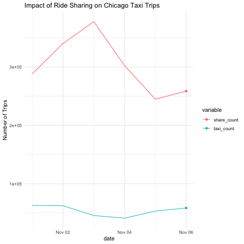

```{r setup, include=FALSE}
knitr::opts_chunk$set(echo = TRUE)
```


```{r, include = FALSE}
pacman::p_load(tidyverse, pacman, ggmap, janitor, sf, mapview, leaflet, rgdal, RColorBrewer, ggplot2, data.table, readr, qqplotr, GGally, lubridate, raster, spData, spDataLarge, tmap, osmdata, gifski, jsonlite, zoo,gganimate,plotly)
```

## Continue the last session in previous Rmd
To explore the impact of ride sharing app on the traditional taxi industry, we add the outside dataset [Transportation Network Providers - Trips](https://data.cityofchicago.org/Transportation/Transportation-Network-Providers-Trips/m6dm-c72p) from Chicago Government which provides the ride sharing trips data.

However, the data starts from November 2018. Hence we are only allowed to explore the relationship between taxi trips and ride sharing trips since then. Moreover, the dataset keeps updating and the latest records have timestamps in September 2021. Hence, the following analysis will only use the fully available data from November 2018 to August 2021 for both taxi trips and ride sharing trips.

```{r, echo = FALSE}

```

`share_count` indicates the number of trips in Chicago from ride sharing companies Uber, Lyft, and Via [source](https://www.chicago.gov/city/en/depts/bacp/supp_info/transportation-network-providers.html), while `taxi_count` gives the number of normal taxi trips in Chicago.

Findings from the plot:
- Before April 2020, share riding companies already take much larger market shares compared to normal taxi companies. They mostly go up or down together.
- On April 2020, both business were hit hard by the pandemic. While the share riding trips count drops significantly, the taxi trips count is approaching 0.
- After April 2020, share riding business recovers gradually while taxi business recovers much slower with quite minor increase.

```{r}
# knitr::include_graphics("trips_by_year.gif")
```

